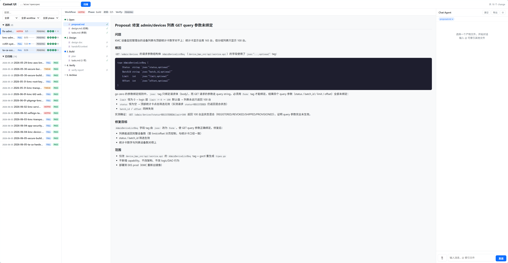
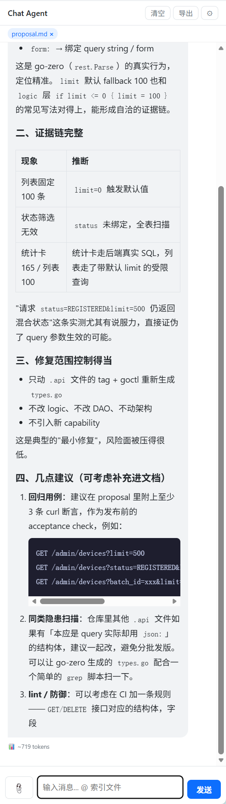
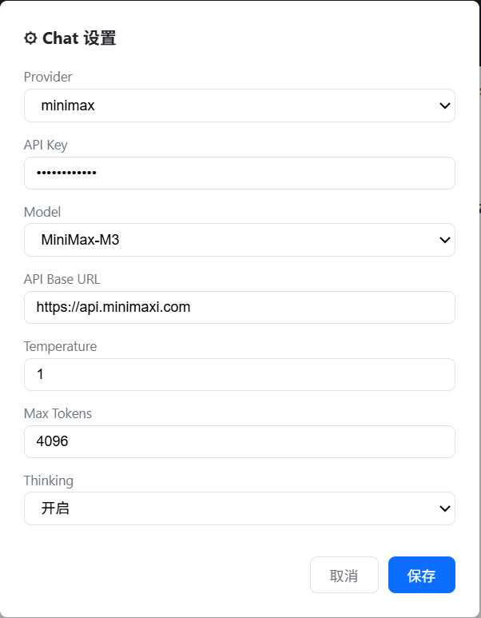

# Comet Panel

> A graphical dashboard for the [Comet](https://github.com/rpamis/comet) development workflow — browse changes, inspect artifacts, and chat with AI about your documents.

[English](#english) | [中文](#chinese)

---

<a id="english"></a>
## Overview

Comet Panel is a **read-only desktop dashboard** that visualizes [Comet](https://github.com/rpamis/comet) change directories. It scans your OpenSpec `changes/` and `archive/` folders, presents them in a three-column layout, renders markdown artifacts, and lets you chat with an AI assistant about any document.

**Zero dependencies.** A single Go binary with an embedded web frontend. Download, run, open your browser.

## Screenshots

| Dashboard | Detail + Chat |
|-----------|--------------|
|  |  |

| AI Chat With Document Context |
|-------------------------------|
|  |

## Features

### Dashboard
- **Change list** grouped by active/archived, with search and filter by workflow and phase
- **Task progress** bar with completed/total counts parsed from `tasks.md`
- **Artifact badges** showing which artifacts exist (proposal, design, tasks, plan, verify report)
- **Verify status** badges (pass / pending / fail)

### Detail View
- **Phase-ordered artifact tree** — see every artifact organized by Comet's 5 phases (Open → Design → Build → Verify → Archive)
- **Markdown rendering** with GFM tables, checkboxes, and code blocks
- **Mermaid diagram rendering** — architecture diagrams and flowcharts render as SVGs inline
- **Task progress bar** with percentage when viewing `tasks.md`

### AI Chat Agent
- **Document-aware** — automatically loads the currently-viewed artifact as context
- **Multi-file context** — type `@` to index any artifact from the current change
- **Streaming responses** — SSE streaming with token-by-token rendering
- **Markdown + Mermaid** — AI-generated tables, diagrams, and code blocks render natively
- **Multi-modal** — paste images (Ctrl+V) for visual analysis (MiniMax M3)
- **Thinking display** — expandable reasoning blocks show the model's thought process
- **Multi-turn conversations** — sessions are isolated per change, switch changes freely
- **Export** — download entire conversation as a `.md` file
- **Multi-provider** — configurable LLM backend (MiniMax, with OpenAI/Anthropic stubs)

### Customization
- **Configurable directory** — scan any OpenSpec directory at runtime
- **Provider settings** — configure API Key, model, temperature, max tokens, and thinking mode in the UI
- **Persistent config** — settings saved to `~/.comet-ui/config.json`

## Quick Start

### Prerequisites

- **Go 1.22+** (1.26 recommended)
- A [MiniMax API Key](https://platform.minimaxi.com/user-center/basic-information/interface-key) (for AI chat)

### Install & Run

```bash
# Clone
git clone https://github.com/sudashannon/comet-panel.git
cd comet-panel

# Run
go run .
```

Your browser opens automatically at `http://localhost:8080`.

### As a Submodule

```bash
# In your Comet project
git submodule add https://github.com/sudashannon/comet-panel.git comet-panel
cd comet-panel
go run .
```

### CLI Options

```
comet-panel --port 8080 --dir openspec
```

| Flag | Default | Description |
|------|---------|-------------|
| `--port` | `8080` | HTTP server port |
| `--dir` | `openspec` | Path to OpenSpec directory (relative or absolute) |

## Configuration

### Directory

The directory can be changed at runtime via the input field in the top bar. Supports both relative paths (`../my-project/openspec`) and absolute paths (`/home/user/project/openspec`).

### AI Provider

Click the ⚙ button in the Chat panel to configure:

| Field | Default | Description |
|-------|---------|-------------|
| Provider | `minimax` | LLM provider |
| API Key | *(empty)* | Your MiniMax API key (starts with `sk-`) |
| Model | `MiniMax-M3` | Model name |
| API Base URL | `https://api.minimaxi.com` | API endpoint |
| Temperature | `1.0` | Response randomness (0-2) |
| Max Tokens | `4096` | Maximum output tokens |
| Thinking | `auto` | Show/hide model reasoning |

All settings are saved to `~/.comet-ui/config.json` with `0600` permissions.

## Architecture

```
comet-panel/
├── main.go                  # HTTP server, routing, embed
├── scanner.go               # File system scanner, .comet.yaml parser
├── chat/
│   ├── config.go            # ~/.comet-ui/config.json management
│   ├── session.go           # In-memory conversation sessions
│   ├── handler.go           # HTTP handlers (SSE streaming, REST)
│   └── provider/
│       ├── provider.go      # Provider interface + registry
│       └── minimax.go       # MiniMax Anthropic-compatible implementation
├── static/
│   ├── index.html           # SPA shell (three-column layout)
│   ├── app.js               # Frontend logic (~450 LOC vanilla JS)
│   └── style.css            # Stylesheet
└── docs/
    └── screenshots/         # Screenshots
```

### Tech Stack

| Layer | Technology |
|-------|-----------|
| Backend | Go 1.26 (stdlib only — no external dependencies) |
| Frontend | Vanilla JavaScript (no framework) |
| Markdown | [marked.js](https://marked.js.org) |
| Diagrams | [mermaid.js](https://mermaid.js.org) |
| AI API | MiniMax Anthropic-compatible Messages API |

### API Endpoints

| Method | Path | Description |
|--------|------|-------------|
| `GET` | `/api/changes` | List all changes |
| `GET` | `/api/changes/:name` | Get change detail with phase-structured artifacts |
| `GET` | `/api/artifact` | Get artifact file content (query: `path`, `dir`) |
| `POST` | `/api/chat/message` | Send message, SSE streaming response |
| `GET` | `/api/chat/session` | Get conversation history (query: `change`) |
| `DELETE` | `/api/chat/session` | Clear conversation (query: `change`) |
| `GET` | `/api/chat/config` | Get provider configuration |
| `PUT` | `/api/chat/config` | Update provider configuration |
| `GET` | `/api/chat/providers` | List registered providers and models |

## Development

```bash
# Run with hot-reload (rebuild frontend on changes)
go run .

# Build standalone binary
go build -o comet-panel .

# Run from any directory
./comet-panel --dir /path/to/openspec
```

## Related

- [Comet](https://github.com/rpamis/comet) — OpenSpec + Superpowers dual-star development workflow
- [MiniMax API](https://platform.minimaxi.com/docs) — LLM API documentation

## License

Apache 2.0 — see [LICENSE](LICENSE)

---

<a id="chinese"></a>
## 概述

Comet Panel 是一个**只读桌面看板**，用于可视化 [Comet](https://github.com/rpamis/comet) 开发流程中的 change 目录。扫描 OpenSpec 的 `changes/` 和 `archive/` 文件夹，以三栏布局呈现，渲染 markdown 产物，并支持 AI 对话分析文档。

**零依赖。** 单个 Go 二进制文件，内嵌前端。下载、运行、打开浏览器。

## 功能

### 看板
- **Change 列表** — 按活跃/归档分组，支持搜索、workflow 和 phase 筛选
- **任务进度条** — 解析 `tasks.md` 复选框，显示完成数/总数
- **产物徽章** — 显示 proposal、design、tasks、plan、verify report 的存在状态
- **Verify 状态** — pass / pending / fail 标签

### 详情视图
- **阶段产物树** — 按 Comet 5 阶段组织产物（Open → Design → Build → Verify → Archive）
- **Markdown 渲染** — GFM 表格、复选框、代码块
- **Mermaid 图表** — 架构图和流程图作为 SVG 内联渲染
- **任务进度** — 查看 `tasks.md` 时显示百分比进度条

### AI Chat Agent
- **文档感知** — 自动以当前查看的产物为对话上下文
- **@ 索引文件** — 输入 `@` 选择当前 change 的任意产物文件
- **流式输出** — SSE 逐 token 渲染
- **Markdown + Mermaid** — AI 生成的表格、图表、代码块原生渲染
- **多模态** — Ctrl+V 粘贴图片（MiniMax M3 支持）
- **思维链展示** — 可展开的推理过程块
- **多轮对话** — 会话按 change 隔离
- **导出** — 下载完整对话为 `.md` 文件
- **多 Provider** — 可配置 LLM 后端

### 定制
- **目录可配** — 运行时切换扫描目录
- **Provider 设置** — 界面配置 API Key、模型、温度、最大 token、thinking 模式
- **持久化** — 设置保存至 `~/.comet-ui/config.json`

## 快速开始

### 前提

- Go 1.22+（推荐 1.26）
- [MiniMax API Key](https://platform.minimaxi.com/user-center/basic-information/interface-key)（AI 对话需要）

### 安装运行

```bash
git clone https://github.com/sudashannon/comet-panel.git
cd comet-panel
go run .
```

浏览器自动打开 `http://localhost:8080`。

### 作为 Submodule

```bash
git submodule add https://github.com/sudashannon/comet-panel.git comet-panel
cd comet-panel && go run .
```

### CLI 参数

```
comet-panel --port 8080 --dir openspec
```

| 参数 | 默认值 | 说明 |
|------|--------|------|
| `--port` | `8080` | HTTP 服务端口 |
| `--dir` | `openspec` | OpenSpec 目录路径（相对或绝对） |

## 配置

目录可以在顶部输入框中随时修改，支持相对路径和绝对路径。

点击 Chat 面板右上角 ⚙ 配置 AI Provider：

| 字段 | 默认值 | 说明 |
|------|--------|------|
| 模型 | `MiniMax-M3` | 支持 1M token 上下文窗口 |
| API Key | *(空)* | MiniMax API 密钥 |
| Temperature | `1.0` | 输出随机性 (0-2) |
| Max Tokens | `4096` | 最大输出 token 数 |
| Thinking | `auto` | 显示/隐藏推理过程 |

所有设置保存至 `~/.comet-ui/config.json`（权限 0600）。

## 相关

- [Comet](https://github.com/rpamis/comet) — OpenSpec + Superpowers 双星开发流程
- [MiniMax API](https://platform.minimaxi.com/docs) — LLM API 文档
