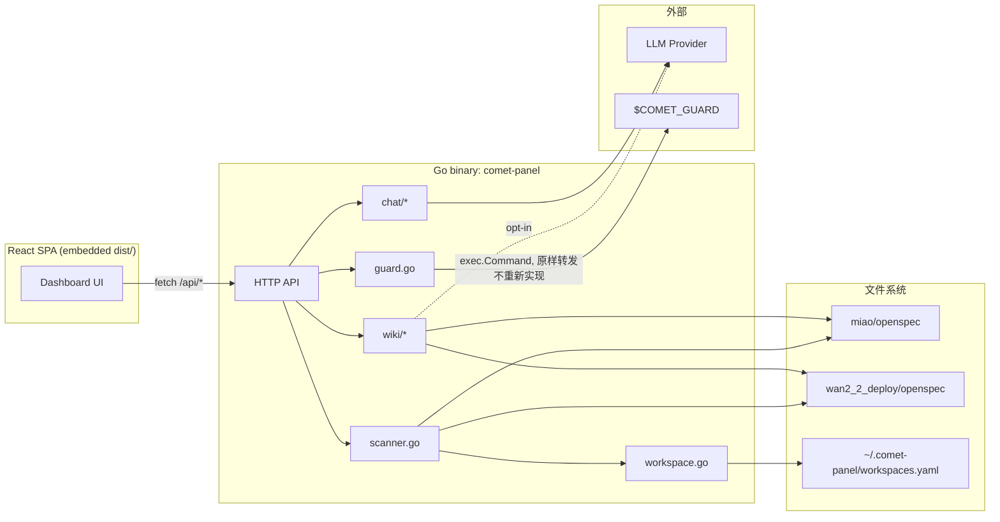

# comet-panel V2.0 架构设计

**日期**: 2026-07-09
**状态**: 设计阶段（brainstorming 已确认，待用户 review）
**作者**: 协作设计（orchestrator + oracle 审核 + 用户决策）

## 背景与动机

comet-panel 是围绕本地 comet 工作流（open→design→build→verify→archive 五阶段状态机）搭建的只读监控面板，服务 `miao` 等 OpenSpec workspace。本次 V2.0 设计基于四轮调研：

1. **Upstream comet 进展**（rpamis/comet，0.3.7 → 0.4.0-beta.2）：5 阶段架构未变，但新增 `review_mode`/`tdd_mode`/`auto_transition` 等字段，0.4.0 引入 `comet dashboard`（React+Tailwind）、`.comet/run-state.json` 状态拆分
2. **miao workspace 使用现状**：15 个 active change，8 个卡在 build（53%），存在状态机不一致（`archived` vs `phase` 矛盾）、2 个 orphan change（无 `.comet.yaml`）、升级摩擦（自定义字段需手动 patch）
3. **comet-panel 能力缺口**：`scanner.go` 仅消费 7/27+ 个 `.comet.yaml` 字段，用户手动维护的 `visualized`/`design_reviewed`/`verify_reviewed` 审查门信号完全未被展示
4. **Upstream dashboard UI/UX + obsidian-llm-wiki 适配性**：确认了配色/组件/文案的具体差距，以及文档关系图谱（backlinks/graph）的可行架构

本次 session 过程中也修复了 3 个真实 bug（`fixImages` 路径解析、5 处 SVG XML 转义、`makeArtifactExt` bare filename 解析），这些修复的路径处理经验直接指导了 Phase③ 的链接解析设计。

## 目标 / 非目标

**目标**：
- 补齐面板对 `.comet.yaml` 字段的消费（尤其是审查门信号）
- UI/UX 对齐 upstream dashboard 的视觉水准（配色、字体、组件、中文文案）
- 支持跨 workspace 聚合展示（miao + wan2_2_deploy + 未来新增）
- 建立文档关系图谱能力（backlinks、Lint 健康检查、图谱视图、可选 LLM 摘要）
- 提供受控的 phase 转换写操作，不绕过现有 guard 逻辑

**非目标**（本次明确排除）：
- 暗色模式、Git Snapshot 面板、Risk 面板（体验加分项，非核心，推迟）
- 向量检索实际启用（评估了 alibaba/zvec，判定不适用；预留 chromem-go 接口但默认关闭）
- 绕过/重新实现 comet-guard 判断逻辑
- 直接编辑 `.comet.yaml` 任意字段（写操作仅限 phase 转换按钮）
- 批量操作（phase 转换一次只处理一个 change）

## 整体架构

### 架构方案：渐进式 Go 单体 + 清晰内部边界

评估过 3 个方案（完全单体不分包 / Go核心+Node sidecar / 渐进式单体+预留边界），选择**渐进式单体**：运维体验与现状完全一致（单 binary、单 systemd service），Phase③ wiki 子系统作为独立 Go package，不与现有 `scanner.go` 代码纠缠，为未来可能的 Node/Python 拆分预留清晰接口边界（但当前不做拆分投资）。

Node sidecar 方案被否决的原因：Phase③ 已明确排除向量检索/PPR，主要论据（Node 生态 markdown AST/LLM 工具更成熟）不足以抵消两个运行时的部署复杂度。

### 包结构

```
comet-panel/
├── main.go              # HTTP server + 路由（现有，扩展多 workspace 感知）
├── scanner.go            # change/artifact 扫描器（现有，按 workspace 参数化）
├── workspace.go          # 【新】workspaces.yaml 加载 + 多 root 注册表
├── chat/                 # 现有 AI Chat 后端，不变，SSE 基础设施复用于 Phase④
│   ├── handler.go / config.go / session.go / provider/
├── wiki/                 # 【新】Phase③ 子系统，独立 package 边界
│   ├── scan.go            # 文件扫描 + frontmatter 解析 → index
│   ├── links.go           # markdown 链接抽取（goldmark AST）→ graph
│   ├── graph.go           # 邻接表 + backlinks 查询
│   ├── lint.go             # 孤儿/死链/重复/任务-产物缺失检测
│   ├── retrieve.go         # Retriever 接口：keywordRetriever（默认）+ vectorRetriever（chromem-go，关闭）
│   ├── summarize.go        # LLM 摘要（opt-in，复用 chat/provider 接口）
│   └── api.go              # /api/wiki/* 路由
├── guard.go              # 【新】Phase④ — exec.Command 转发到 $COMET_GUARD，SSE 流式回显
└── web/                   # 【新】React+Vite 前端源码，替代现有 static/
    ├── src/components/{PhaseStepper,KpiCards,TaskDonut,ChangeExplorer,ChangeDetail,ChatBubble,WikiGraph,GuardButton}.tsx
    ├── vite.config.ts
    └── dist/               # 构建产物，go:embed 嵌入替代原 static/*
```

### 数据流



### 构建/部署

- **本地开发**：`cd web && npm run dev`（Vite dev server 代理 `/api` 到 `:8989`）+ `go run .`
- **生产构建**：`cd web && npm run build` → `web/dist/` → `go build`（`//go:embed web/dist`）
- **systemd service**：不变
- **GitHub Actions CI**：在现有 `go build` 前插入 Node 安装 + `npm run build`

---

## Phase① — Panel Core Refresh

**范围**：配色/字体/文案 + 核心可视化套件（KPI 卡 + Phase Stepper + Task Donut + review 徽章）。不做暗色模式、Git Snapshot、Risk 面板。

### 视觉系统

| Token | 值 |
|-------|-----|
| accent | `#0063f8` |
| success | `#16a34a` |
| danger | `#dc2626` |
| warn | `#c47a06` |
| 字体 | Inter，通过 npm 包引入（如 `@fontsource/inter`，随 Vite 构建打包，不依赖运行时 CDN），`-webkit-font-smoothing: antialiased` |
| Phase 中文映射 | open→启动, design→设计, build→构建, verify→验证, archive→归档 |
| verify 中文映射 | pass→通过, fail→验证失败, pending→待验证 |

### 布局（已通过可视化伴侣确认：方案 B）

- 5 张 KPI 卡（网格布局）：活跃变更 / 已归档 / **卡死预警**（build 阶段停留时长超阈值高亮，阈值可配置，默认 14 天）/ Verify 失败 / 未完成任务
- Change Detail 头部：Phase Stepper（横向 5 步，编号圆圈+连接线+✓完成态）与 Task Progress Donut **并排**（非独占一行），信息密度更高
- Review 徽章：复用 upstream Pill 组件模式（`rounded-full` + tone 色），展示 `visualized`/`design_reviewed`/`verify_reviewed` 三个自定义字段的完成状态

### Chat 面板（已通过可视化伴侣确认：方案 3）

悬浮气泡按钮（右下角），点击展开覆盖层。仪表盘主区域保持全宽可用，Chat 是叠加而非常驻并存。后端 API（`chat/handler.go` 等）不变，仅前端迁移到 React 组件。

### scanner.go 字段消费扩展

新增消费：`visualized`, `design_reviewed`, `verify_reviewed`, `created_at`（active change 也展示，不再局限于 archived）, `verified_at`, `build_mode`, `review_mode`, `tdd_mode`, `auto_transition`。同时检测并告警 `archived` 与 `phase` 状态不一致的情况。

### 响应式布局（移动端支持）

**背景**：现有 vanilla JS + 定宽三栏布局在手机浏览器上显示异常，此前通过纯 CSS media query 补丁临时缓解（受限于不能改 HTML 结构）。该补丁已在设计阶段主动丢弃（未提交过，属于另一 session 的未完成工作，用户确认在 Phase① 交付前接受移动端短暂回归的窗口期风险）。React+Tailwind 重写从组件设计阶段原生解决响应式布局，不再依赖事后补丁。

**目标断点行为**（对齐 upstream dashboard 已验证的模式）：
- `xl` 以下：三栏（侧边栏/详情/Chat气泡覆盖层）收为单栏纵向堆叠
- 侧边栏在窄屏收进 hamburger 菜单（点击展开为覆盖层，不占用主内容宽度）
- KPI 卡片网格在窄屏从 5 列/3 列自动收为 2 列或 1 列（Tailwind `grid-cols-2 md:grid-cols-3 lg:grid-cols-5` 模式）
- Phase Stepper + Task Donut 并排布局在窄屏下改为纵向堆叠（避免挤压导致文字重叠）
- Chat 悬浮气泡本身天然适配移动端（覆盖层展开，不受栏宽限制）

**当前状态**：生产环境手机浏览器显示在 Phase① 上线前会持续异常（无兜底补丁）。响应式布局因此从"锦上添花"升级为 Phase① **硬性交付项**，不可推迟到后续迭代。

---

## Phase② — 多 Workspace 聚合

**范围**：配置文件驱动的多 workspace 支持，UI 可添加 + 热重载，默认聚合展示 + 可筛选。

### 配置文件

```yaml
# ~/.comet-panel/workspaces.yaml
workspaces:
  - alias: miao
    path: /home/shanl/workspace/miao/openspec
    color: "#0063f8"
  - alias: wan2_2_deploy
    path: /home/shanl/workspace/wan2_2_deploy/openspec
    color: "#16a34a"
```

### scanner.go 改动

- 扫描函数参数化：`scanChanges(workspaceAlias, root string) []Change`
- `Change` 结构体新增 `Workspace string` 字段
- 聚合函数 `scanAllWorkspaces(registry []WorkspaceConfig) []Change`

### API

```
GET  /api/workspaces           → 已注册 workspace 列表
POST /api/workspaces           → { alias, path, color } → 写回配置文件 + 内存注册表热更新
GET  /api/changes?workspace=   → 可选筛选，缺省聚合全部，每项带 workspace 字段
```

### 写入范围说明

这里的"写"是 comet-panel **自身的配置文件**，不触碰被监控项目的 `.comet.yaml`，风险性质与 Phase④ 完全不同，不需要走确认弹框机制。

### 前端

顶部筛选 chip 行：`全部 | miao | wan2_2_deploy | + 添加`。点击"+添加"弹出表单（alias/path/color），提交后 POST，chip 行热更新。

---

## Phase③ — 文档关系图谱

**范围**：全量版本（MVP 核心 + Lint 引擎 + 图谱视图 + LLM 摘要 opt-in），预留 chromem-go 检索接口但默认关闭。参考 obsidian-llm-wiki 架构模式，但不移植其 Obsidian 插件本体（三层分离、frontmatter 契约、wikilink 图、Lint 健康模型这几个模式直接适用；LLM 实体抽取和 PPR 检索按我们的规模判定不需要）。

### 3a：核心（Component Index + Graph + Backlinks）

```go
package wiki

type ComponentType string
const (
    TypeChange   ComponentType = "change"
    TypeProposal ComponentType = "proposal"
    TypeDesign   ComponentType = "design"
    TypeTasks    ComponentType = "tasks"
    TypeSpec     ComponentType = "spec"
    TypePlan     ComponentType = "plan"
    TypeArtifact ComponentType = "artifact"
    TypeDiagram  ComponentType = "diagram"
)

type Component struct {
    ID          string // 绝对路径规范化后作为稳定 ID
    Type        ComponentType
    Title       string
    Path        string
    Workspace   string
    Frontmatter map[string]any
    UpdatedAt   time.Time
}

type Edge struct {
    From, To string
    Kind     string // references | implements | generates | traces-back | supersedes
    Source   string // "yaml"(高置信) | "markdown-link" | "slug-match"(低置信，仅 Lint 建议)
}
```

**链接来源分层**（直接复用本次 session 修复过的路径解析经验，杜绝 bug 重现）：

| 层级 | 来源 | 置信度 | 实现 |
|------|------|--------|------|
| 1 | `.comet.yaml` 的 `design_doc`/`plan`/`verification_report` | 最高 | 直接复用 `makeArtifactExt`（本次已修复的路径解析逻辑） |
| 2 | Markdown `[text](path)` 链接 | 高 | `goldmark` AST 解析，路径解析复用第1层逻辑 |
| 3 | `task-NN-*.md` artifact 命名约定 | 高 | 目录+文件名约定匹配，无需解析内容 |
| 4 | 正文裸提及 change 名（模糊匹配） | 低 | 不自动建边，仅作为 Lint 建议 |

**索引存储**：`.wiki/index.json` + `.wiki/graph.json`（纯 JSON，330 篇文档规模无需数据库，启动时全量加载）

**API**：
```
GET  /api/wiki/index
GET  /api/wiki/component/:id     → component + 正向链接 + backlinks
GET  /api/wiki/search?q=
POST /api/wiki/rebuild            → 增量重扫（只处理 mtime 变化文件）
```

### 3b：附加层

**Lint 引擎**：

| 规则 | 逻辑 |
|------|------|
| 孤儿文档 | 零入边+零出边（排除根节点 change） |
| 死链 | markdown 链接指向的路径无对应 component |
| 重复文档 | 标题相同/内容前 N 行高度重合 |
| 任务-产物缺失 | `tasks.md` 有 N 项任务（编号 1..N）；对每个任务编号检查 `artifacts/<slug>/` 下是否存在**至少一个** `task-NN-*.md`（不按文件总数比较，避免同一任务的多角色文件——implementer/spec-review/code-review/oracle-review——虚高计数）；缺失的任务编号列入报告 |

结果通过 `GET /api/wiki/lint` 输出，UI 独立 Lint 面板展示，不自动修复。

**图谱视图**：Cytoscape.js 力导向图，节点按 `ComponentType` 上色/按连接数定大小，点击跳转详情面板，支持 workspace/类型/日期筛选。

**LLM 摘要**（opt-in）：详情页手动触发"生成摘要"按钮（不批量跑），缓存到 `.wiki/summaries/<id-hash>.md`，源文件 mtime 变化才失效，复用 `chat/provider` 接口。

**向量检索预留**（默认关闭）：

```go
type Retriever interface {
    Search(query string, k int) ([]Component, error)
}
// keywordRetriever: index.json 关键词匹配（默认启用）
// vectorRetriever:  chromem-go 实现（feature flag 关闭）
```

**为什么不用 alibaba/zvec**（已调研排除）：zvec-go 是 CGO 绑定 C++ 库，违反"单 Go binary 无 sidecar"约束（CGO 破坏纯 Go 静态/交叉编译）；zvec 设计目标千万级向量，我们 330 篇文档暴力余弦相似度扫描微秒级足够；Go SDK 仅 2 周历史不成熟。若未来语料涨到万级以上，`chromem-go`（纯 Go 零 CGO 零依赖）是正确选择。

---

## Phase④ — 写操作与治理

**范围**：仅 phase 转换按钮，等价于命令行 `$COMET_GUARD <name> <phase> --apply`，不绕过 guard 逻辑，不支持任意字段编辑，不支持批量操作。

### 核心原则

comet-panel **绝不重新实现 guard 判断逻辑**，只做"代人跑同一条命令"——永远原样 shell out 到 `$COMET_GUARD` 解析出的实际脚本（无论 legacy `.sh` 还是 0.4.0 的 `.mjs` launcher），保证行为与 CLI 永久一致。

### 后端

```go
// guard.go
func TriggerTransition(changeName, targetPhase string) (io.ReadCloser, error) {
    guardPath := resolveCometGuard() // 复用 comet-env 逻辑
    cmd := exec.Command(guardPath, changeName, targetPhase, "--apply")
    cmd.Stdout, cmd.Stderr = pipeWriter, pipeWriter
    return pipeReader, cmd.Start()
}
```

- **并发保护**：内存按 change name 互斥锁，同一 change 转换进行中，第二个请求返回 409
- **API**：`POST /api/changes/:name/transition` body `{targetPhase}` → SSE 流，复用 `chat/handler.go` 现有 SSE 基础设施

### 前端交互

1. 点击"→ 构建"等转换按钮
2. 确认弹框：显示即将执行的命令原文 + 目标 phase
3. 确认后开 SSE 连接，命令输出实时滚动
4. 结束显示退出码：成功（绿色✓，自动关闭+列表刷新）/ 失败（红色✗，输出保留待手动关闭）

### 明确排除

不提供跳过 guard 检查的后门；不支持编辑任意 `.comet.yaml` 字段；不支持批量转换。

---

## 测试与错误处理（跨阶段横切面）

### 测试策略

| Phase | 重点 |
|-------|------|
| ① | Vitest + RTL：Stepper 状态渲染、KPI 动画、Donut 百分比计算；响应式断点用 Playwright 视口切换验证（`xl`/`md`/`sm` 三档实际渲染无重叠无溢出）；不做像素级视觉回归 |
| ② | Go 单测：workspace 注册表加载/热重载、多 root 聚合合并逻辑 |
| ③ | Go 单测覆盖链接提取，**必须包含本次 session 真实 bug 场景作为回归 case**（多层 `../` 折叠、bare filename 解析、路径越界防护）；Lint 规则用 fixture 文档集测试 |
| ④ | 假脚本 mock 测 SSE 流式转发、确认弹框状态机、并发锁拒绝逻辑 |

### 错误处理

| 场景 | 处理 |
|------|------|
| Phase② workspace 路径不存在/不可读 | 跳过该 workspace，顶部警告横幅，不影响其他 workspace |
| Phase③ 遇到格式错误的 markdown | 跳过+记录日志，不中断整体索引 |
| Phase④ guard 脚本找不到/不可执行 | 点击前检测，直接提示错误，不打开确认弹框 |
| Phase④ guard 执行中崩溃 | SSE 回传非零退出码+stderr，确认弹框保持打开展示错误 |

---

## 实施排期与审核关卡

- **①②并行**设计+实施（低风险、不重叠：一个改 UI/scanner 字段，一个改多 workspace 收集）→ 完成后统一 **oracle 审一次**
- **③串行**实施（内部按 3a核心→Lint→图谱→LLM摘要 的天然降级顺序，若中途需收缩范围不影响已交付部分）→ 完成后 **oracle 审一次**
- **④串行**实施（写操作，风险最高，需要格外仔细）→ 完成后 **oracle 审一次**

## 开放风险

| 风险 | 缓解 |
|------|------|
| React 重写范围可能超预期（Chat 迁移+8个新组件+Vite构建链） | Phase①②并行阶段结束后的 oracle 审核重点检查这一项 |
| Phase③ 全量版本（14-16天原估）叠加向量检索预留后实际耗时未知 | 内部降级顺序（3a→Lint→图谱→LLM）保证部分交付价值不为零 |
| goldmark AST 解析未必能 1:1 复现所有既有 markdown 链接写法 | 3a 单测覆盖已知边界场景，异常记录到 Lint 报告而非静默失败 |
| Phase④ 引入写能力后如果 guard 脚本本身有 bug，面板会放大暴露 | 严格遵循"不重新实现，只转发"原则，出错立即原样回显，不做面板侧兜底修复 |
