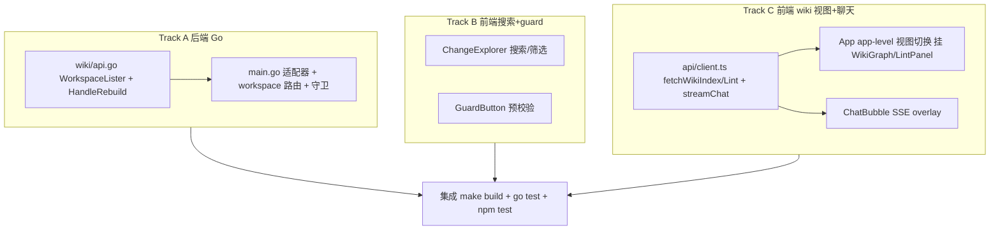

# 实施计划 — comet-panel V2 功能修复与补全

subagent-driven-development, tdd_mode=tdd, review_mode=standard, isolation=branch。

## 任务分组与并行编排

5 个能力分为 3 个可并行的独立 track（无共享文件冲突）+ 1 个串行集成 track。

## Track A — 后端（Go）

### A1. wiki 一致性
- `wiki/api.go`：定义 `type WorkspaceLister interface { List() []WorkspaceConfig }`（wiki 包内，用 `wiki.WorkspaceConfig`）。`API` 增字段 `lister WorkspaceLister`；`HandleRebuild` 若 `lister != nil` 用 `lister.List()`，否则回退 `a.ws`。
- TDD：`wiki/api_test.go` 先写失败测试——注入一个 fake lister，rebuild 后 index 反映 lister 返回的新 workspace。

### A2. main.go 适配器 + workspace 路由
- 适配器：`main.go` 定义 `type registryLister struct{ reg *WorkspaceRegistry }`，`List()` 用 `toWikiWorkspaces(reg.List())` 转 `[]wiki.WorkspaceConfig`；装配处传入。
- `handleGetChange`/`handleGetArtifact`/`handleTransition`：解析 `?workspace=<alias>`，registry 查 path；`?workspace=` 优先 `?dir=`；未注册 alias → 400；空注册表/无参回退 `baseDir`。artifact path-traversal 守卫基于解析后 root 重算。
- TDD：`main_workspace_test.go`/`main_transition_test.go` 先写失败测试（?workspace 路由命中正确目录 + baseDir 回退 + 未注册 alias 400）。

## Track B — 前端搜索 + guard（纯前端，独立文件）

### B1. ChangeExplorer 搜索/筛选
- `ChangeExplorer.tsx`：顶部搜索框 + status/workflow/phase `<select>`；受控 state；作用于传入的（KPI 过滤后）changes prop；交集过滤 active+archived；空结果提示；清空恢复。
- TDD：`ChangeExplorer.test.tsx` 先写失败测试（搜索子串、单筛选、组合、清空、空结果）。

### B2. GuardButton 预校验
- `GuardButton.tsx`：加 `isValidChangeName(name)=/^[a-z][a-z0-9]*(?:-[a-z0-9]+)*$/.test(name)`；非法 disabled + title 提示。
- TDD：`GuardButton.test.tsx` 先写失败测试（合法可点击 / 非法禁用+tooltip）。

## Track C — 前端 wiki 视图 + 聊天

### C1. api/client.ts
- 新增 `fetchWikiIndex()`、`fetchWikiLint()`；`streamChat(change, message, contextFiles, onEvent)`：先 `if(!res.ok){读 JSON 错误体 throw}` 再 `res.body.getReader()` 解析 `data: {json}\n\n`（事件 thinking/delta/done）。
- TDD：`client.test.ts` 覆盖 streamChat res.ok 分支 + wiki fetch。

### C2. App app-level 视图切换
- `App.tsx`：顶部/侧栏视图切换（变更 / 图谱 / Lint）；图谱挂 `WikiGraph`（onNodeClick 打开组件文档/聚焦），Lint 挂 `LintPanel`；空索引降级。
- TDD：`App.test.tsx` 覆盖视图切换渲染。

### C3. ChatBubble SSE overlay
- `ChatBubble.tsx`：overlay body = 消息列表 + textarea + 发送键；调 `streamChat`，累积 delta 渲染 markdown；缺 key（HTTP 4xx 错误体）显示错误提示；上下文文件注入。
- TDD：`ChatBubble.test.tsx` 覆盖发送+流式、缺 key 错误、会话隔离。

## 集成 track（串行，主会话协调）

- `make build`（npm build → go build）；`go test ./...`；`npm test`（web/）全绿。
- 确认既有 computeStateWarning + scanner_test.go 不回归。
- 一次轻量最终代码审查（review_mode=standard）覆盖整个 change。
- 手动冒烟指向 miao openspec。

## 约束

- 零 API 破坏；新增查询参数向后兼容。
- 不改 comet-guard；不新增状态不一致检测（已实现）。
- 每任务先失败测试再实现（tdd）。
