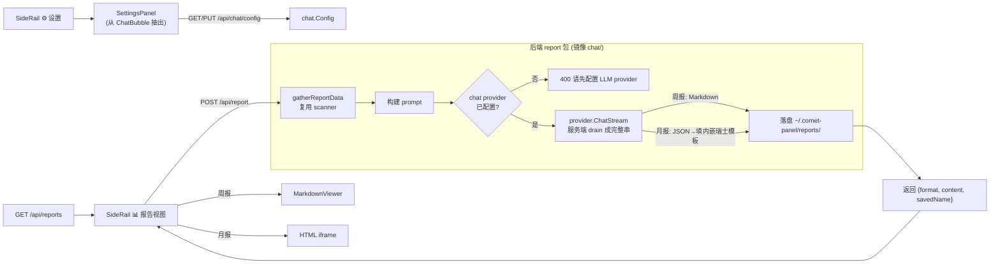

# comet-panel 报告生成（周报+月报）设计文档

- 日期：2026-07-10
- 状态：待用户复审
- 前提：用户已配置 LLM provider（复用 chat 子系统的 provider 配置作为 gate）
- 依赖模板：`~/.agents/skills/guizang-ppt-skill/assets/template-swiss.html`（瑞士风单页，月报底座）

## 1. 目标与非目标

**目标**：在 comet-panel 内原生生成工作报告，由已配置的 LLM provider 驱动，数据源为面板已扫描的 comet changes + docs。
- 周报 → Markdown（复用现有 MarkdownViewer）
- 月报 → 结构化 JSON 填充内嵌瑞士风 HTML 模板（M1 方案）
- 报告落盘 `~/.comet-panel/reports/`，页内列历史、可重看/下载
- 顺带：把 ChatBubble 内的 provider 设置面板抽出，挪到 SideRail ⚙️ 设置入口
- 顺带修复：切换 SideRail 视图时未关闭 MarkdownViewer 的既有行为

**非目标（YAGNI）**：
- 不接飞书 / lark-cli（面板进程无飞书凭证）→ 报告只覆盖 comet+docs 追踪的工作，不含 MR/会议来源（诚实边界）
- 不做流式生成（阻塞式，服务端 drain 完整结果）
- 月报不让 LLM 直接吐 HTML（M2），只吐结构化 JSON 由 Go 填模板（版式确定、不崩）
- 不改 chat 消息/会话逻辑；不改后端 provider 接口

## 2. 架构



## 3. 后端：新 `report` 包（镜像 `chat/` 结构）

### 3.1 端点（注册在 main.go）
- `POST /api/report` — body `{type:"weekly"|"monthly", start:"YYYY-MM-DD", end:"YYYY-MM-DD", workspace?:string}`；流程：组装数据 → provider gate → 阻塞合成 → 落盘 → 返回 `{format:"markdown"|"html", content:string, savedName:string}`。
- `GET /api/reports` — 返回历史列表 `[{name, type, start, end, createdAt}]`（按 createdAt 倒序）。
- `GET /api/reports/get?name=<name>` — 返回单份 `{format, content}`（name 做路径穿越校验，仅允许 reports 目录内）。

### 3.2 provider gate（复用 chat）
```go
cfg, _ := chat.LoadConfig()
pcfg, ok := cfg.Providers[cfg.ActiveProvider]
if !ok || pcfg.APIKey == "" { writeJSONError(w, "请先配置 LLM provider", 400); return }
p := provider.Get(cfg.ActiveProvider)
```
阻塞式 drain（复用 HandleMessage 的 textBuf 写法）：
```go
eventCh, err := p.ChatStream(ctx, pcfg.APIKey, pcfg.APIBase, pcfg.Model, systemPrompt, messages, opts)
var buf strings.Builder
for ev := range eventCh { if ev.Type == "delta" { buf.WriteString(ev.Content) } }
full := buf.String()
```

### 3.3 数据组装 `gatherReportData(baseDir, start, end, workspace) (*ReportData, error)`
- 复用 scanner 逻辑：扫归档（目录日期前缀 ∈ [start,end]）+ active change；读每个的 `.comet.yaml`（date/phase/verifyResult）+ `proposal.md` 的 `## Why` / `## What Changes`。
- 按 workspace 过滤（空=全部，复用现有 workspace 注册）。
- 产出结构化语料 `ReportData{Range, Workspace, Changes:[]{Name,Date,Phase,Verify,TasksDone,TasksTotal,Why,What}, Counts:{Total,Active,Archived,...}}`。
- 纯读，不碰飞书。

### 3.4 周报合成
systemPrompt 套 weekly-skill 模板结构（概述 / 主题表格 / 关键成果 / 下周计划），把 ReportData 序列化进 user message → LLM 出 Markdown → 落盘 `.md`。

### 3.5 月报合成（M1）
- systemPrompt 要求 LLM **只输出 JSON**（给定 schema），字段：
  ```
  { "title", "period", "kpis": {"total","active","themes","reports","platforms"},
    "overview": "3句主线",
    "themes": [{"name","count","items":["..."]}],   // ≤6
    "highlights": {"left":{"title","points":[...]}, "right":{"title","points":[...]}},
    "milestones": [{"date","text"}] }               // ~9
  ```
- Go 解析 JSON → 填入 `//go:embed` 打进二进制的**瑞士风单页模板**（基于 template-swiss 精简出占位版 `report-monthly.tmpl.html`，保留 IKB 蓝 + KPI 顶栏 + 2×3 主题卡 + 双栏重点 + 里程碑时间线 + footer）→ 落盘 `.html`。
- 用 Go `html/template`；LLM 只填数据不排版，规避崩版。
- **早期视觉验收 gate**：实现时先用一组真实 change 数据渲染出月报 HTML 截图给用户确认版式，认可后再继续。

### 3.6 落盘
- 目录 `~/.comet-panel/reports/`（不存在则创建，与 workspaces.yaml 同父目录约定）。
- 文件名 `<type>-<start>_<end>-<unixts>.<md|html>`。
- 历史列表从目录文件名解析元数据（type/start/end/createdAt）。

## 4. 前端

### 4.1 SideRail 加第 4 视图 + 设置入口
- `ITEMS` 增加 `{key:'report', label:'报告', icon:'📊'}`；App 的 `view` 联合类型加 `'report'`。
- 底部 ⚙️ 设置从 disabled 占位改为可点击，`onOpenSettings` 打开 SettingsPanel（modal 或抽屉）。

### 4.2 ReportView 组件（新）
- 参数区：区间预设（本周/上周/本月/上月/自定义起止）· workspace 选择（全部/指定）· 类型（周报/月报）。
- 「生成」按钮 → POST /api/report；生成中显示进度态（"正在汇总 N 个 change… 合成中…"）。
- 结果区：周报 → MarkdownViewer；月报 → `<iframe srcdoc>` 或 blob URL。下载按钮。
- 历史列表：GET /api/reports，点击项 → GET 单份 → 展示。
- gate 态：provider 未配置时显示引导（"请先在 ⚙️ 设置中配置 LLM provider"）+ 跳设置入口。

### 4.3 SettingsPanel 组件（从 ChatBubble 抽出）
- 把 ChatBubble 现有设置面板逻辑（openSettings/handleProviderChange/handleSaveSettings + provider/model/apiKey/temperature/maxTokens/thinking 表单）抽成独立组件，保留所有 `chat-settings-*` testid。
- ChatBubble 移除内部 ⚙️ 设置入口与面板，改为纯聊天；SideRail ⚙️ 挂载 SettingsPanel。
- SettingsPanel 复用现有 `/api/chat/config` `/api/chat/providers`，无后端改动。

### 4.4 markdown 切换修复
- App 现有 `setView` 直接传给 SideRail `onSelect`。改为包一层：
  ```tsx
  function handleViewChange(v: View) { setViewerPath(null); setView(v) }
  ```
  SideRail `onSelect={handleViewChange}`。切任意视图先关 MarkdownViewer。
- 图谱视图内点节点仍 `setViewerPath(component.path)` 打开文档（视图内动作不受影响）。

## 5. 测试策略

**后端（Go，LLM mock 掉）**：
- `gatherReportData`：区间日期过滤（含/不含边界）、跨 workspace 聚合、active+archived 都纳入（fixture change 目录）。
- provider gate：未配置 provider → POST /api/report 返回 400。
- 月报 JSON→模板填充：给定合法 JSON 渲染出含关键字段（title/kpis/themes/milestones）的 HTML；非法 JSON 报错不崩。
- 落盘 + 历史：写入后 GET /api/reports 能列出、GET 单份能取回；文件名路径穿越校验（`../` 拒绝）。

**前端（Vitest）**：
- ReportView：参数交互、类型切换、生成中进度态、gate 引导态（provider 未配置）、周报走 MarkdownViewer / 月报走 iframe、历史列表点击加载。
- SettingsPanel：从 SideRail ⚙️ 入口打开，provider/model/apiKey 表单 + 保存（迁移 `chat-settings-*` testid，断言不弱化）。
- **markdown 切换回归**：打开 viewer 后切视图 → viewer 关闭（`viewerPath` 清空）；图谱内点节点仍开。
- 保留所有现有 testid；全量 vitest + tsc + go test/vet 绿。

## 6. 错误处理
- provider 未配置：400 + 前端引导到设置。
- LLM 调用失败：500 + 前端显示错误、允许重试。
- 月报 LLM 返回非法 JSON：后端捕获 → 500「月报数据解析失败，请重试」，不崩服务。
- 区间无 change：正常生成"本区间无跟踪变更"的空报告，不报错。
- 落盘失败（权限/磁盘）：500，但生成的内容仍返回给前端展示（落盘失败不吞结果）。

## 7. 实施顺序（供计划参考）
1. 后端 report 包：数据组装 + gate + 周报合成 + 落盘 + 端点（LLM mock 测）
2. 月报模板内嵌 + JSON 填充 + **早期截图验收 gate**
3. 前端 SettingsPanel 抽出 + SideRail ⚙️ 挂载（含 ChatBubble 移除设置）
4. 前端 ReportView + SideRail 📊 视图 + markdown 切换修复
5. 全量验证 + 构建 + 视觉验收（周报/月报/设置/切换）
