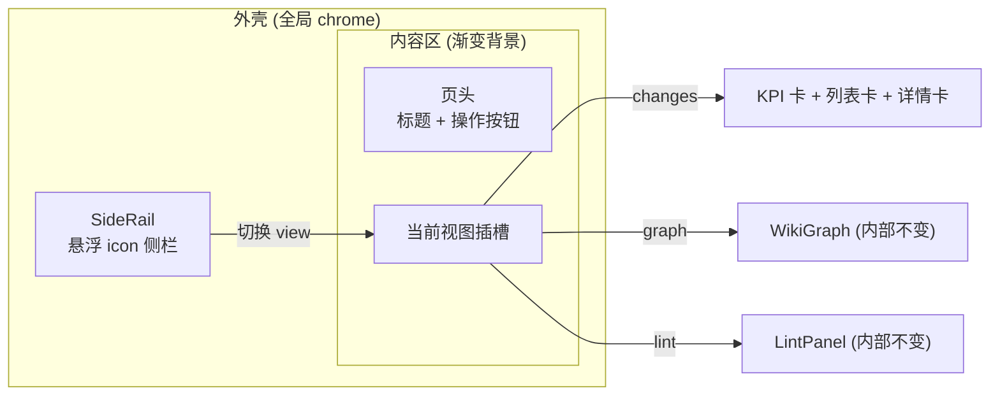

# comet-panel V2 视觉重塑（方向 A）设计文档

- 日期：2026-07-10
- 状态：待用户评审
- 范围：纯视觉/布局 reskin，**不改数据流、不改 API、不改交互语义**
- 参考：用户提供的账号监控仪表盘 UI（悬浮侧栏 + 渐变背景 + 图标 KPI 卡 + 柔和阴影）
- 已批准的视觉稿：`/tmp/mock/dirA.html`（截图见对话）

## 1. 目标与非目标

**目标**：把参考图的"设计语言"套到 comet-panel 现有的信息架构上，提升质感与产品感：
- 左侧**悬浮胶囊 icon 侧栏**取代顶部文字 tab 作为视图切换器
- 蓝白**渐变背景**取代当前扁平灰底
- KPI 卡升级为**彩色图标 chip + 大数字 + 柔和阴影**
- 所有面板卡片统一**大圆角 + 柔阴影**
- 阶段 stepper / 任务 donut 视觉精修（组件已存在，仅调样式）

**非目标（YAGNI）**：
- 不改任何 fetch / 状态 / 路由逻辑
- 不引入参考图里我们没有的功能按钮（不放假按钮）
- 不重排主从布局（列表→详情仍是主从，参考图的账号网格不适用我们的领域）
- 不动「图谱」「Lint」视图的内部组件（WikiGraph / LintPanel 内部不变），仅让它们继承新外壳

## 2. 架构：外壳 vs 视图

当前 `App.tsx` 结构：`外层(flex-col) → 移动端 hamburger → 顶部 nav(view-switcher) → warning banner → 各视图内容`。

新结构：**外壳(左侧 rail + 渐变背景 + 内容区头部)为全局 chrome，三视图共用**。

- **SideRail**（新组件 `web/src/components/SideRail.tsx`）：竖直胶囊，上组 3 个视图图标 🚀 变更列表 / 🗺️ 图谱 / ✓ Lint（A1 精确映射），底部 ⚙️ 设置（占位 disabled，`title="即将推出"`）。选中态 = 蓝底白字 + 投影。接收 `view` / `onSelect` props（复用 App 现有的 `view` state 与 `setView`）。
- **App.tsx**：外层改为 `flex`（rail 为 `flex-0` 左栏，内容区 `flex-1`）；外层背景改渐变；删除顶部 `<nav>`（其职责移入 SideRail）；页头（标题 + 右上操作）抽为内容区顶部一行。

## 3. 组件级改动清单

| 文件 | 改动 | 风险 |
|---|---|---|
| `App.tsx` | 外层 flex + 渐变底；删顶部 nav；插入 `<SideRail>`；内容区加页头行；三视图包进统一内容容器 | 中（布局重排，需保留所有 data-testid） |
| `SideRail.tsx` **(新)** | 悬浮 icon 侧栏，视图切换 + 设置占位 | 低 |
| `SideRail.test.tsx` **(新)** | 渲染 3 视图图标；点击触发 onSelect；选中态 aria-pressed | 低 |
| `KpiCards.tsx` | 卡片加图标 chip（每类一色）+ 阴影 + 大数字；卡死预警卡描边高亮 | 低（保留 testid 与 onFilterSelect） |
| `WorkspaceChips.tsx` | chip 圆角药丸化；添加表单卡片阴影（错误态样式已有，保留） | 低 |
| `ChangeExplorer.tsx` | 行 hover/选中态圆角高亮；进度条语义色（沿用阶段色）；徽章圆角 | 低（保留搜索/筛选/分组 testid 与自动展开逻辑） |
| `ChangeDetail.tsx` | 详情卡圆角阴影；页头(标题+徽章)排版 | 低 |
| `PhaseStepper.tsx` | dot/连接线精修（done 绿 / cur 蓝带光晕 / todo 灰） | 低 |
| `TaskDonut.tsx` | 环形完成度视觉对齐参考图（尺寸/配色/中心数字） | 低 |
| 全局 | 抽一组 Tailwind 卡片样式约定（`rounded-2xl shadow-[…]`）在各卡片复用 | 低 |

## 4. 设计令牌（沿用现有色板，仅新增质感）

- 背景渐变：`linear-gradient(135deg,#e9eeff 0%,#f2f4fb 38%,#fdfdff 100%)`
- 卡片：`rounded-2xl` + `shadow-[0_6px_20px_rgba(30,32,60,.05),0_1px_2px_rgba(0,0,0,.03)]`
- 主色蓝 `#0063f8`（不变）；阶段语义色：open 灰 / design 蓝 / build 琥珀 / verify 紫 / archive 绿（沿用现有徽章色）
- rail 选中：蓝底白字 + `shadow-[0_6px_14px_rgba(0,99,248,.35)]`
- 圆角层级：卡片 16–18px、rail 22px、chip/按钮 10–12px、药丸 999px

## 5. 响应式与可访问性

- **桌面 (`xl+`)**：rail 固定左侧常显；changes 视图为 `340px 列表 + 1fr 详情` 双栏。
- **窄屏 (`<xl`)**：rail 仍常显（仅 4 图标、~60px 宽，成本低）；changes 视图降为单栏，工作区/列表用现有 `sidebarOpen` 抽屉逻辑（hamburger 保留，移入内容区页头）。
- **a11y**：rail 图标 `aria-label` + `aria-pressed`；设置占位 `disabled` + `aria-disabled`；对比度维持 WCAG AA；焦点态保留。

## 6. 测试策略

这是纯视觉改动，**关键约束是不破坏现有 141 个测试的选择器与行为断言**：
- 保留所有 data-testid：`view-switcher`（迁移到 SideRail，值不变）、`sidebar`、`hamburger-toggle`、`change-empty-state`、`workspace-warning-banner`、KpiCards 各 testid、`add-ws-*`、ChangeExplorer/LintPanel 现有 testid。
- 视图切换断言（`aria-pressed`）在 SideRail 上继续成立。
- 新增 `SideRail.test.tsx`：3 图标渲染 + 点击切换 + 选中态。
- 改动组件的现有测试若因 DOM 结构调整失败，属 fixture/选择器维护——更新选择器，不弱化行为断言。
- 全量 `npx vitest run` + `npx tsc --noEmit` 绿；`go test ./...` 不受影响（无后端改动）。
- 视觉验收：1920px 与窄屏各截图，对照视觉稿确认。

## 7. 错误处理

无新增数据路径，故无新增错误处理。warning banner（`failedWorkspaces`）保留，套用新卡片质感。

## 8. 实施顺序（供计划参考）

1. 外壳：App 外层渐变 + flex + SideRail（+ 删顶部 nav），三视图挂载不变 → 验证三视图可切换、testid 在
2. KpiCards 质感升级 → 验证 filter 交互与 testid
3. 列表侧：WorkspaceChips + ChangeExplorer 精修
4. 详情侧：ChangeDetail + PhaseStepper + TaskDonut 精修
5. 响应式收尾 + 全量测试 + 1920px/窄屏视觉验收
