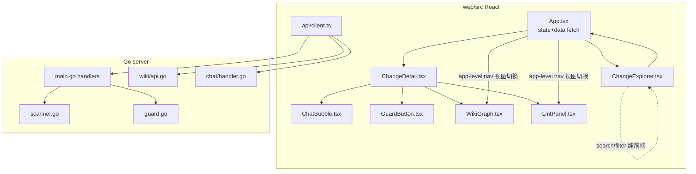

# Design Doc — comet-panel V2 功能修复与补全

深度技术设计。canonical spec 为 OpenSpec delta spec，本文档细化实现方案、风险、测试策略与边界条件。

## 背景与证据

来自 hands-on 评测（二进制运行指向 miao openspec，788 wiki 组件 / 599 lint 问题）确认的缺陷，逐项定位到文件与根因。

## 组件交互总览

## 逐能力技术设计

### 1. workspace-wiki 一致性（后端，根因级）
**根因**：`wiki/api.go:120 HandleRebuild` 用构造时冻结的 `a.ws`；运行时 `reg.Add` 不传导。
**方案**：`API` 结构持有 registry 快照提供者而非静态切片。最小侵入做法——`main.go` 装配处将 `reg` 传入，`HandleRebuild` 调用 `provider()` 实时取列表再 `BuildIndex`。
- 接口：在 `wiki` 包定义 `type WorkspaceLister interface { List() []WorkspaceConfig }`（此处 `WorkspaceConfig` 是 `wiki.WorkspaceConfig`）。`main.WorkspaceRegistry.List()` 返回 `main.WorkspaceConfig`，**不直接满足**该接口——需在 `main.go` 装配处加一个适配器（复用现有 `toWikiWorkspaces` 转换），把 registry 包装为 lister 传入。
- `NewAPIWithWorkspaces` 增加可选 lister；`HandleRebuild` 优先用 lister。
- 边界：lister 为 nil 时回退现有 `a.ws`（保持单测与旧行为）。

### 2. multi-workspace 路由（后端）
**根因**：`handleGetChange`/`handleGetArtifact`/`handleTransition` 只用 `*baseDir`。
**方案**：三者解析可选 `?workspace=<alias>` → registry 查 path 作为工作目录；缺省/空注册表回退 `baseDir`（现有单目录行为零回归）。
- `handleTransition` 的 `workspaceDir` 参数改为按 alias 解析。
- 边界：alias 未注册 → 400 明确错误，不静默用 baseDir。`?workspace=` 优先级高于既有 `?dir=`；同时出现时以 `?workspace=` 为准（`?dir=` 仅在无 workspace 参数且注册表为空时生效），避免两套路径解析冲突。artifact 的 path-traversal 守卫（`strings.HasPrefix(absPath, rootAbs)`）必须基于解析后的 workspace root 重新计算，防止跨 workspace 越权。

### 3. 状态不一致检测（已实现——本次仅验证）
**现状**：`scanner.go` 已有 `ChangeSummary.StateWarning` + `computeStateWarning(archived, phase)`（含 `phase != ""` 空值守卫），已被 `scanChange` 调用、`scanner_test.go` 覆盖、`ChangeDetail.tsx` 渲染。**本能力不新增实现**（原 eval 漏检），仅在验证阶段确认其行为与回归覆盖。不得引入 `archived != (phase=="archive")` 朴素判定——它会对空 phase 的归档变更误报，弱于现有实现。
### 4. change-explorer 搜索/筛选（前端，纯客户端）
**方案**：`ChangeExplorer.tsx` 顶部搜索框 + 3 个 `<select>`（status/workflow/phase）。受控 state（本地 useState 即可，数据全量在内存）。交集过滤 active+archived 两段。
- 边界：空结果显示"无匹配"；清空恢复全量。

### 5. wiki 视图接线（前端，全局）
**方案**：`WikiGraph`/`LintPanel` 是**全局跨变更**组件（拉全量 `/api/wiki/*`，无变更过滤参数）。在**应用级导航**（与 ChangeExplorer 同级的视图切换，非嵌入 ChangeDetail）挂载。`api/client.ts` 补 `fetchWikiIndex()`/`fetchWikiLint()`。
- `WikiGraph` 的 `onNodeClick` 行为：点击节点打开该组件文档（MarkdownViewer）或聚焦，不得为死键。
- 边界：空索引 → 组件 empty-state（"索引为空，先注册 workspace 并重建"）。
### 6. 聊天 SSE 接线（前端）
**方案**：迁移 V1 `static/app.js` 聊天契约到 React。`api/client.ts` 加 `streamChat(change, message, contextFiles, onEvent)`，用 fetch + ReadableStream 解析 `data: {json}\n\n` SSE。**实际事件类型仅 `thinking`/`delta`/`done`（无 in-stream `error` 事件）**。`ChatBubble.tsx` overlay body：消息列表 + textarea + 发送键；累积 delta 渲染 markdown。
- 会话隔离：后端 `chat.SessionStore` 已按变更名 keyed，前端按 `changeName` 请求即可。
- 边界：缺 API key / provider 错误是**流开启前的 HTTP 4xx/5xx JSON 响应**，不是 SSE 事件。`streamChat()` MUST 先检查 `res.ok`（如 `GuardButton.tsx` 现有模式）再 `res.body.getReader()`，并把 JSON 错误体的 message 显示给用户；网络级失败用外层 try/catch 兜底（对齐 V1 app.js）。
### 7. GuardButton 前置校验（前端）
**方案**：`GuardButton.tsx` 加 `isValidChangeName(name)` = `/^[a-z][a-z0-9]*(?:-[a-z0-9]+)*$/.test(name)`（与 comet-guard 0.4.0 对齐）。非法 → 按钮 disabled + title 提示"变更名不满足 guard 规则（需字母开头），无法迁移"。

## 测试策略
- **Go**：`wiki/api_test.go`（rebuild 反映运行时新增 workspace）、`main_workspace_test.go`/`main_transition_test.go`（?workspace 路由 + baseDir 回退 + 未注册 alias 400）。状态不一致检测已由 `scanner_test.go` 覆盖，仅验证不新增。
- **React**（Vitest + Testing Library）：各组件 `.test.tsx` 覆盖搜索/筛选、Tab 切换、聊天发送+流式+缺 key、GuardButton 合法/非法。
- **集成**：`make build` + `go test ./...` + `npm test` 全绿；手动冒烟指向 miao openspec。

## 风险与缓解

| 风险 | 缓解 |
|------|------|
| SSE 事件格式与后端不匹配 | 以 V1 app.js 现有实现为参考，读 chat/handler.go 确认事件字段 |
| 一致性检测（已实现） | 不改动 computeStateWarning；仅验证既有 `scanner_test.go` 覆盖，不引入朴素判定 |
| Cytoscape 大图性能（788 节点） | 全局图谱在 app-level 视图；如需性能优化按邻域裁剪（复用现有实现） |

## 非目标

暗色模式、Git Snapshot、风险面板、向量检索、重写 comet-guard、任意 `.comet.yaml` 编辑。
