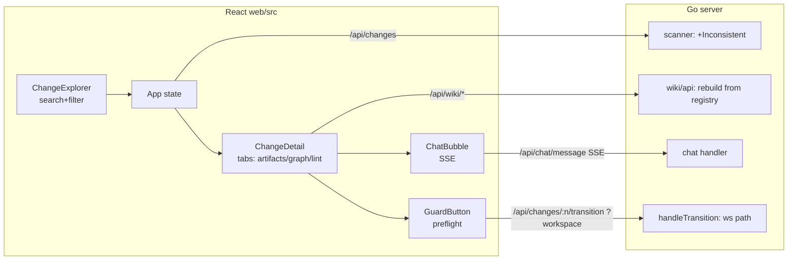

# Design — complete-v2-dashboard-features（高层框架）

> 高层架构决策与方案选型。深度技术设计在 design 阶段的 Design Doc 细化。

## 架构原则

- **零破坏**：`/api/*` 契约不变；仅新增向后兼容的查询参数与响应字段。
- **优先接线而非重写**：孤儿组件（WikiGraph/LintPanel）与后端 wiki/chat 端点已就绪，集成为主。
- **guard 不重实现**：前置校验只做名字合法性预判，真正判定仍由 comet-guard 脚本负责（`guard.go` 契约不变）。

## 各能力方案选型

### dashboard-chat
- 复用 V1 `static/app.js` 的聊天交互契约（SSE、`@`-mention 上下文、消息累积），迁移为 React。
- `ChatBubble.tsx` overlay body 内嵌消息列表 + 输入行；`api/client.ts` 新增 `streamChat()`（EventSource/fetch-stream 消费 `/api/chat/message`）。
- 会话隔离由后端 `chat.SessionStore`（按变更名 keyed）保证，前端按 `changeName` 拉取。

### dashboard-wiki-views
- `WikiGraph.tsx`（Cytoscape）与 `LintPanel.tsx` 接入 `ChangeDetail` 或 App 级视图切换。
- 入口方案：详情面板内 Tab 切换（工件 / 图谱 / Lint），避免新增顶栏路由复杂度。
- 空索引降级：组件内 empty-state 分支。

### change-explorer-search
- `ChangeExplorer.tsx` 顶部加搜索框 + 三个筛选下拉（受控 state 提升到 App 或本地 useState）。
- 纯前端过滤（数据已全量在内存），无需新增后端端点。

### workspace-wiki-consistency（后端）
- `wiki/api.go` `HandleRebuild`：改为接收一个 registry 快照提供者（函数/接口），rebuild 时实时读取当前注册表，而非构造时冻结的 `a.ws`。
- `main.go` 装配处传入 registry 引用，使 wiki 与 workspace 单一事实源对齐。

### multi-workspace-routing（后端）
- `handleGetChange`/`handleGetArtifact`/`handleTransition`：接受可选 `?workspace=<alias>`，用 registry 解析该 alias 的 path 作为工作目录；未提供或注册表空时回退 `--dir`（保持现有单目录行为）。

### state-inconsistency-detection
- `scanner.go`：在 `ChangeSummary` 增加 `Inconsistent bool` + 原因，判定 `archived && phase != "archive"`（或反向）。
- 前端 `ChangeDetail`/卡片渲染不一致徽章。

### guard-action-preflight
- `GuardButton.tsx`：新增 `isValidChangeName(name)` 前置校验（正则 `^[a-z][a-z0-9]*(?:-[a-z0-9]+)*$` 与 guard 0.4.0 对齐），非法则 disabled + tooltip。

## 数据流（高层）

## 非目标

- 暗色模式、Git Snapshot 面板、风险面板（沿用 V2 设计文档非目标）。
- 向量检索（chromem-go 保持关闭）。
- 重写 comet-guard 判定逻辑。
- `.comet.yaml` 任意字段编辑（写入仍限于 guard 迁移按钮）。

## 风险

- 前端 SSE 迁移需匹配后端事件格式（thinking/delta）——以 V1 app.js 为参考实现。
- workspace 路由回退逻辑需保证单 workspace/无注册表部署零回归。
